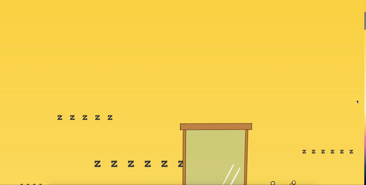
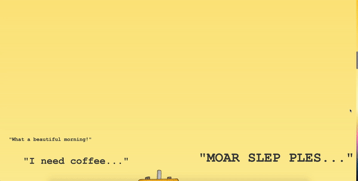
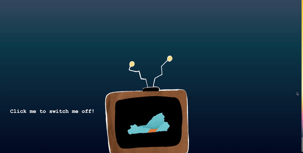

# The Daily Life of JackBob

A comic by Chris, Quim, and Vee

This is what the comic looks like:

### Project Description
This project is an interactive comic that tells the story of JackBob, a man with a television for a head, and an event that happens as he goes about his daily life. Our team was striving to create a comic that would be lighthearted, warm, and a little whimsical, which we created through the writing, style of illustration and background monologue. 

### Process
* Creating a relatable protagonist
Our team wanted to create a protagonist that readers would find relatable. To achieve this, we chose to make JackBob a (literal) blank screen, which, as per McCloud's comic principles, allows for readers to more easily see themselves in a character. This meant that we could not express JackBob's emotions by drawing them on his face. Instead, we chose to convey these emotions through JackBob's monologue and textual emoticons, which maintained a high level of abstraction.

* Controlling the flow of time
Our team chose to use the background of our comic to creating a sense of time passing. The background colors throughout the comic closely resemble that of sunlight throughout the day: JackBob wakes up to the sun shining through his window, and the day fades to dusk as he says goodbye to the old woman and "switches off" (goes to sleep). This background, along with the gutters present in nearly each panel, helped us control and represent the passage of time throughout a day in JackBob's life.

* Implementing interactivity
We chose to implement two main interactive features in this comic: a parallax scrolling effect, and an animation triggered by a click. The parallax scrolling effect was implemented on JackBob and the passersby's monologue, so lines would scroll at different speeds relative to each other and the panels. The animation, implemented on the very last panel, allows readers to "switch Jackbob off". 

Several examples of the parallax scrolling effect:
 

This is the on click interaction to turn Jackbob off and another example of the parallax scrolling effect:

* Bonus: Symbolism!
JackBob may seem like an odd name, but of course, it is really just two very common names spliced together. The name JackBob is a symbol of JackBob himself: the unusual combination of two common things (a television and a human)!

### Reflection
We felt that although the parallax scrolling added to the feeling of depth and interactivity of this story, it decreased responsiveness on different screen sizes. This was exacerbated by the fact that the lines of the monologue generally had to be positioned quite precisely in order to add meaning to the panels. If we had known this in the beginning, our team would most likely have chosen to implement the parallax scrolling effect on less volatile elements of the comic and/or chosen to implement different forms of interactivity. 

Overall, we are very satisfied with the final product. Despite the minor issues with responsiveness, we were able to create the experience we had set out to. We initially set out to create a story about a man turning into a television, but eventually decided on this form of the story since it better conveyed the experience and emotions that we were aiming to elicit from our audience. JackBob brings us joy, and we hope you enjoy him too!
